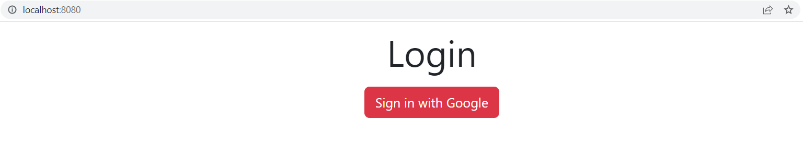
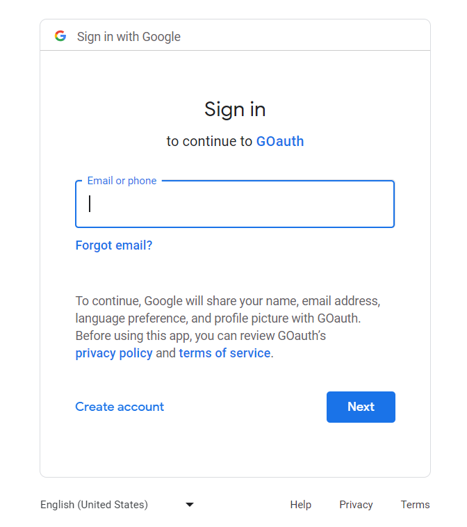
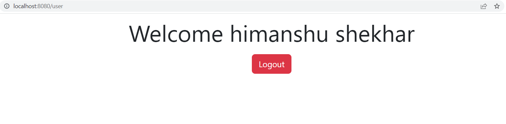
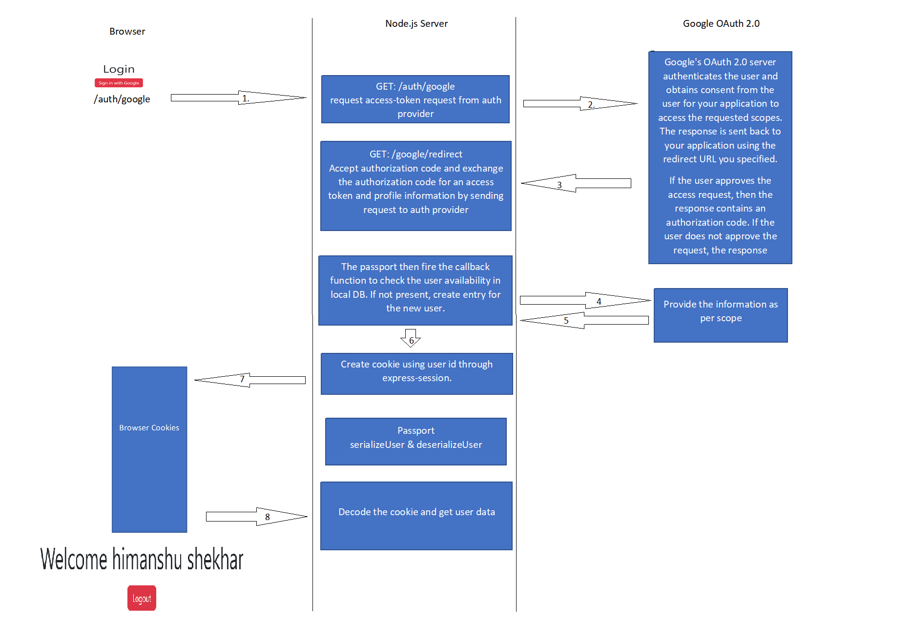

# Node OAuth 2.0

The Application implement the OAuth 2.0 using Node.js and Passport.js
## Login Page


## Consent Page


## User Profile Page



## Built With
1. Node.js
2. Passport.js
3. Postgres SQL
4. EJS
5. Knex

## Installation

1. Clone the repo
   ```sh
   git clone https://github.com/shekbruce/node_oauth2.git
   ```
2. Install NPM packages
   ```sh
   npm install
   ```

## Running the application

1. Create .env file and add below enironment variables
    * PORT
    * DB_CLIENT
    * DB_HOST
    * DB_PORT
    * DB_USER
    * DB_PASSWORD
    * DB_NAME
    * GOOGLE_CLIENT_ID
    * GOOGLE_CLIENT_SECRET
    * GOOGLE_REDIRECT_URL
    * SECRET_KEY
2. ```sh
   npm run dev-start
   ``` 
3. Go to http://localhost:PORT/  

## Application Work flow



